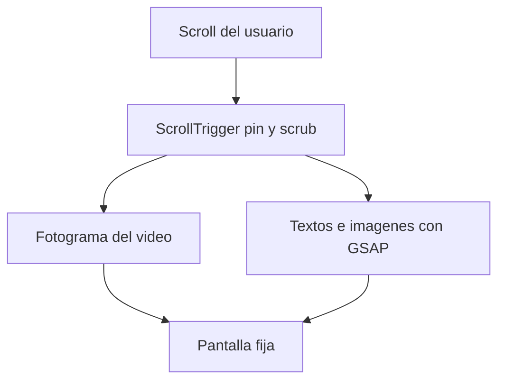

# Qué hace falta para armar el scrollytelling

El guion de [scrollytelling_guion_detallado.md](scrollytelling_guion_detallado.md) ya define la historia en 6 momentos. El repo es un Next.js 16 vacío (`app/page.tsx`); todavía no hay escenas ni assets. Este plan es el encargo de producción: el código espera estas piezas (o placeholders con los mismos nombres).

## Cómo se arma la página

Cada momento es una sección alta. Al hacer scroll, GSAP ScrollTrigger **fija** la pantalla (`pin: true`) y **arrastra** la animación con el scroll (`scrub`). El avance del scroll (0 a 1) hace dos cosas a la vez:

- Mueve el video al fotograma que corresponde (`video.currentTime = progreso × duración`).
- Anima encima, con una timeline de GSAP, los textos, etiquetas e imágenes fijas.



El video tiene que contar **un solo cambio continuo** (campo verde que se marchita, balanza que se inclina, barco que avanza). El scroll sube y baja, así que la pieza se recorre en los dos sentidos.

## Decisiones antes de producir

- **Dirección de arte.** Paleta, tipografía y 2 o 3 referencias (sitios, cortos o ilustraciones). El guion no cambia de estilo al llegar al mar: la misma niebla pasa del campo a la crisis, al Atlántico y a América.
- **Idioma y copy.** Confirmar si las frases del guion son el texto final o si habrá párrafos explicativos extra. Hoy el guion es corto y funciona bien en overlay.
- **Pantalla principal.** Escritorio a pantalla completa, con una versión móvil que recorte el mismo encuadre. Hace falta un área segura central donde el texto se lea en las dos.
- **Dónde la cámara entra y sale.** En `m1-gancho` (bosque → campo), en el par `m3-crisis` + `m4-ruta` (el 3 entra en la niebla, el 4 sale al mar) y en `m5-america` (niebla de la costa → América habitada). En `m2-suelo`, `m5-quiebre` y `m6-flores` la cámara queda fija.
- **El viaje.** Sin mapa. `m4-ruta` arranca en el mismo vacío de niebla con el que cierra `m3-crisis`. La estela entra antes que el casco. El código enciende, en este orden, “Tierras de cereal”, “Metales” y “América”.
- **El cierre.** Un solo video, `m6-flores`: campo europeo cansado a la izquierda, maíz y terrazas en flor a la derecha. Una corriente sale de América hacia Europa. No hace falta una planta en HTML durante los momentos anteriores.

## Especificación de cada video

Un clip por beat, fondo continuo, sin cortes internos, sin audio obligatorio.

- Resolución: **1920×1080**. El texto vive en el centro; los bordes pueden recortarse en móvil.
- Duración: **8 a 15 segundos**. Eso se estira a unas 2–4 pantallas de scroll.
- Fotogramas: **24 o 30 fps**, acción legible también si el usuario se detiene a mitad.
- Entrega recomendada para que el scroll no salte: **secuencia de fotogramas WebP o JPEG** (un archivo por frame) **o** un MP4 H.264 con keyframe en cada frame. Un MP4 muy comprimido se ve a tirones al buscar un tiempo intermedio.
- Peso orientativo: menos de **8–12 MB** por clip en MP4, o una secuencia optimizada equivalente.
- Nombre de archivo estable: `m1-gancho`, `m2-suelo`, `m3-crisis`, `m4-ruta`, `m5-america`, `m5-quiebre`, `m6-flores`.
- Primer y último fotograma sostenidos cerca de medio segundo, para que el texto de entrada y de salida tenga dónde apoyarse.

## Lista de piezas, momento por momento

### Momento 1 — El gancho

- **Texto en código:** título “Cuando la tierra ya no alcanza”, subtítulo, “Haz scroll” y la pregunta final del momento.
- **Video `m1-gancho`:** la cámara entra en el bosque y sale sobre el mismo valle ya cultivado. Termina listo para la pregunta.

### Momento 2 — La tierra comienza a agotarse

- **Video `m2-suelo`:** cámara fija. El mismo campo pasa de trigo vivo a las tres franjas cansadas y luego a tierra pálida. No hay acercamiento.
- **Texto en código**, en este orden de scroll: “La tierra empezó a cansarse” y la cadena Expansión → Más cultivos → Más presión sobre el suelo → Menor productividad.
- **Imágenes pequeñas** (PNG o SVG, fondo transparente): bosque, animales de trabajo, alimento. Aparecen como sellos al lado del video, no dentro de él.

### Momento 3 — La crisis

- **Video `m3-crisis`:** la balanza se inclina y la cámara entra en la niebla hasta llenar el cuadro. Termina en niebla vacía, sin mar. Ese último fotograma es el primero de `m4-ruta`.
- **Texto en código**, una línea cada vez, en el centro, durante la inclinación: hambre y pueblos vacíos; antes que la peste, la guerra, y tampoco había hacia dónde ir; la peste llegó cuando el campo ya se había rendido. Al quedar dentro de la niebla: “Ya no hay hacia dónde ir.” Esas guerras no se dibujan: no son la carabela.

### Momento 4 — Europa mira hacia afuera

- **Video `m4-ruta`:** abre en la niebla vacía del momento 3, sale al Atlántico, aparece la estela y solo después una carabela pequeña. Sin mapa y sin etiquetas quemadas.
- **Texto en código:** “Si los recursos se acababan dentro… había que mirar hacia afuera.” Las etiquetas, en el orden del capítulo 10: Tierras de cereal, Metales, América.

### Momento 5 — América ya tenía una historia

- **Video `m5-america`:** la cámara entra en la niebla de la costa y sale sobre terrazas, maíz, selva y comunidades. El territorio llega habitado. No es tierra vacía ni un edén.
- **Video `m5-quiebre`:** cámara fija, el mismo valle. Las terrazas palidecen, se abre una mina modesta, entra un trigo impuesto y una carabela pequeña espera afuera. Las comunidades siguen en el encuadre.
- **Texto en código:** “Mucho antes de la llegada europea…” y, cuando el mismo valle se interrumpe, “La conquista interrumpió formas de adaptación que ya existían…”. Al quedar el paisaje quebrado, la cita del Chilam Balam. No hay pantalla partida.

### Momento 6 — Cierre

- **Video `m6-flores`:** a la izquierda un campo europeo cansado; a la derecha maíz y terrazas en flor. Una corriente fina sale de América hacia Europa: la flor americana se marchita y el campo europeo reverdece. No es una raíz que lleve vida hacia América.
- **Texto en código:** la cita del Chilam Balam un momento más, luego “¿Hasta dónde puede crecer una sociedad sin transformar el lugar que la sostiene?”, las dos líneas sobre cómo, cuánto y para qué, y el cierre “Ambiente + sociedad + cultura”.

## Qué entregar en una carpeta

```text
assets/
  videos/          m1-gancho, m2-suelo, m3-crisis, m4-ruta, m5-america, m5-quiebre, m6-flores
  referencias/     2 o 3 imágenes de estilo y la paleta (hex)
  textos.md        frases finales, si cambian respecto al guion
```

Con el storyboard (primer y último fotograma de cada video) ya se puede fijar el ritmo de scroll. Los clips finales se sustituyen en los mismos nombres de archivo.

## Cuando eso esté, el código hace esto

- Una página en Next.js, escenas cliente con GSAP ScrollTrigger (`pin` + `scrub`).
- Cada video atado al progreso del scroll; textos e imágenes en la misma timeline.
- Versión con `prefers-reduced-motion`: la escena se muestra en su estado final, con el texto legible, sin depender del scrub.
- El guion actual es la fuente del copy mientras no haya un `textos.md` distinto.

## Pendiente

- [ ] Cerrar paleta, referencias y copy final. El acercamiento de cámara va en m1, en el par m3-crisis + m4-ruta, y en m5-america.
- [ ] Primer y último fotograma de m1, m2, m3-crisis, m4-ruta, m5-america, m5-quiebre y m6-flores. El final de m3-crisis coincide con el inicio de m4-ruta.
- [ ] Entregar videos (secuencia o MP4 all-intra) e imágenes con los nombres acordados
