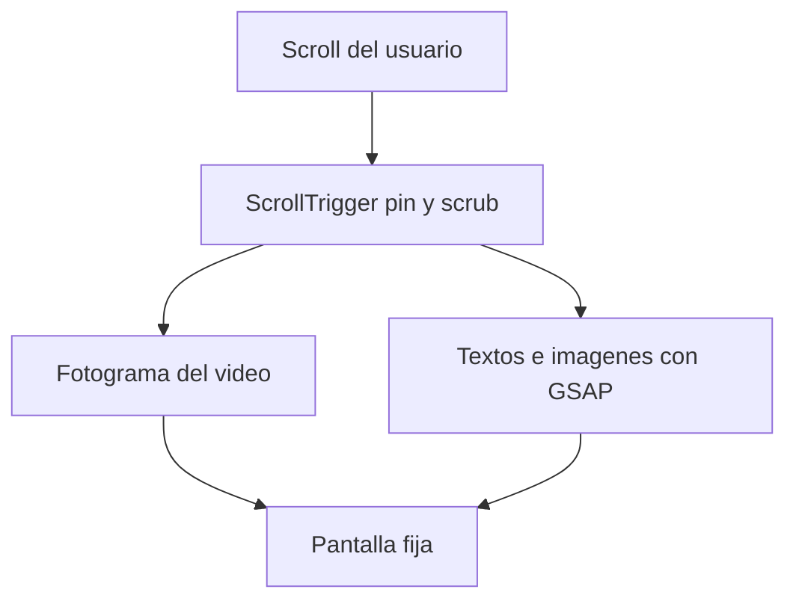

# Qué hace falta para armar el scrollytelling

El guion de [scrollytelling_guion_detallado.md](scrollytelling_guion_detallado.md) ya define la historia en 6 momentos. El repo es un Next.js 16 vacío (`app/page.tsx`); todavía no hay escenas ni assets. Este plan es el encargo de producción: el código espera estas piezas (o placeholders con los mismos nombres).

## Cómo se arma la página

Cada momento es una sección alta. Al hacer scroll, GSAP ScrollTrigger **fija** la pantalla (`pin: true`) y **arrastra** la animación con el scroll (`scrub`). El avance del scroll (0 a 1) hace dos cosas a la vez:

- Mueve el video al fotograma que corresponde (`video.currentTime = progreso × duración`).
- Anima encima, con una timeline de GSAP, los textos, etiquetas e imágenes fijas.



El video tiene que contar **un solo cambio continuo** (campo verde que se marchita, balanza que se inclina, barco que avanza). El scroll sube y baja, así que la pieza se recorre en los dos sentidos.

## Decisiones antes de producir

- **Dirección de arte.** Paleta, tipografía y 2 o 3 referencias (sitios, cortos o ilustraciones). El guion pasa de campo oscuro a mapa y luego a América; esa unidad visual tiene que existir en los videos y en las imágenes.
- **Idioma y copy.** Confirmar si las frases del guion son el texto final o si habrá párrafos explicativos extra. Hoy el guion es corto y funciona bien en overlay.
- **Pantalla principal.** Escritorio a pantalla completa, con una versión móvil que recorte el mismo encuadre. Hace falta un área segura central donde el texto se lea en las dos.
- **Mapa del momento 4.** Cámara fija (el barco se mueve y las etiquetas las pone el código) o video con las etiquetas ya quemadas. Con cámara fija el código puede hacer aparecer “Tierras”, “Cereales”, “Metales” y “Nuevos territorios” en el punto justo del mapa.
- **La planta del cierre.** Una planta pequeña en código durante los momentos 1 a 5, y un video propio de pantalla completa en el momento 6. Así las raíces que cruzan a América no tienen que coincidir pixel a pixel con un elemento HTML.

## Especificación de cada video

Un clip por beat, fondo continuo, sin cortes internos, sin audio obligatorio.

- Resolución: **1920×1080**. El texto vive en el centro; los bordes pueden recortarse en móvil.
- Duración: **8 a 15 segundos**. Eso se estira a unas 2–4 pantallas de scroll.
- Fotogramas: **24 o 30 fps**, acción legible también si el usuario se detiene a mitad.
- Entrega recomendada para que el scroll no salte: **secuencia de fotogramas WebP o JPEG** (un archivo por frame) **o** un MP4 H.264 con keyframe en cada frame. Un MP4 muy comprimido se ve a tirones al buscar un tiempo intermedio.
- Peso orientativo: menos de **8–12 MB** por clip en MP4, o una secuencia optimizada equivalente.
- Nombre de archivo estable: `m1-gancho`, `m2-suelo`, `m3-balanza`, `m4-ruta`, `m5-america`, `m6-raices`.
- Primer y último fotograma sostenidos cerca de medio segundo, para que el texto de entrada y de salida tenga dónde apoyarse.

## Lista de piezas, momento por momento

### Momento 1 — El gancho

- **Texto en código:** título “Cuando la tierra ya no alcanza”, subtítulo, “Haz scroll” y la pregunta final del momento.
- **Video `m1-gancho`:** arranca en fondo oscuro (el título se lee encima). Al avanzar: aparecen campos, poblaciones, sube la producción y bajan los bosques. Termina en un paisaje ya presionado, listo para la pregunta.

### Momento 2 — La tierra comienza a agotarse

- **Video `m2-suelo`:** un campo verde que se vacía hasta quedar marchito. La metáfora es el terreno perdiendo capacidad, en la línea del guion.
- **Texto en código**, en este orden de scroll: “La tierra empezó a cansarse” y la cadena Expansión → Más cultivos → Más presión sobre el suelo → Menor productividad.
- **Imágenes pequeñas** (PNG o SVG, fondo transparente): bosque, animales de trabajo, alimento. Aparecen como sellos al lado del video, no dentro de él.

### Momento 3 — La crisis

- **Video `m3-balanza`:** una balanza. Izquierda: población, ciudades, alimentos. Derecha: producción, bosques, animales de trabajo. Al avanzar, la necesidad crece, los recursos bajan y la balanza se inclina. El final se disuelve a una pantalla casi vacía.
- **Texto en código:** Hambre, Pobreza, Precios altos, Crisis, y el puente “Europa estaba llegando a sus propios límites.”

### Momento 4 — Europa mira hacia afuera

- **Video `m4-ruta` o mapa ilustrado fijo + barco:** Europa, luego la ruta Europa → África → América, con el barco avanzando. Cámara quieta si las etiquetas las pone el código.
- **Texto en código:** “Si los recursos se acababan dentro… había que mirar hacia afuera.” y las etiquetas Tierras, Cereales, Metales, Nuevos territorios.

### Momento 5 — América ya tenía una historia

- **Video o secuencia ilustrada `m5-america`:** América que se llena (maíz, papa, yuca, aguacate, Andes, selva, comunidades). El territorio llega habitado.
- **Dos imágenes fijas**, composición vertical, para la pantalla partida:
  - Izquierda, “Adaptarse al territorio”.
  - Derecha, “Explotar los recursos” (extracción, cereal, barco, riqueza hacia Europa).
- **Texto en código:** “Mucho antes de la llegada europea…” y, cuando las dos mitades se cruzan, “La conquista transformó los ecosistemas y las culturas que ya existían.”
- La mezcla de las dos mitades la hace GSAP sobre esas imágenes. Hace falta un video extra solo si ese cruce se quiere como metraje propio (`m5-cruce`).

### Momento 6 — Cierre

- **Video `m6-raices`:** una planta que crece y cuyas raíces salen del espacio europeo hasta América, hasta ocupar la pantalla.
- **Texto en código:** “¿Hasta dónde puede crecer una sociedad sin transformar el lugar que la sostiene?”, las dos líneas sobre cómo, cuánto y para qué, y el cierre “Ambiente + sociedad + cultura”.

## Qué entregar en una carpeta

```text
assets/
  videos/          m1…m6  (secuencia de frames o mp4 all-intra)
  images/          sellos del momento 2, panel izquierdo y derecho del 5
  referencias/     2 o 3 imágenes de estilo y la paleta (hex)
  textos.md        frases finales, si cambian respecto al guion
```

Con el storyboard (primer y último fotograma de cada video) ya se puede fijar el ritmo de scroll. Los clips finales se sustituyen en los mismos nombres de archivo.

## Cuando eso esté, el código hace esto

- Una página en Next.js, escenas cliente con GSAP ScrollTrigger (`pin` + `scrub`).
- Cada video atado al progreso del scroll; textos e imágenes en la misma timeline.
- Versión con `prefers-reduced-motion`: la escena se muestra en su estado final, con el texto legible, sin depender del scrub.
- El guion actual es la fuente del copy mientras no haya un `textos.md` distinto.

## Pendiente

- [ ] Cerrar paleta, referencias, copy final y si el mapa del momento 4 lleva cámara fija
- [ ] Primer y último fotograma de m1 a m6, más los dos paneles del momento 5
- [ ] Entregar videos (secuencia o MP4 all-intra) e imágenes con los nombres acordados
